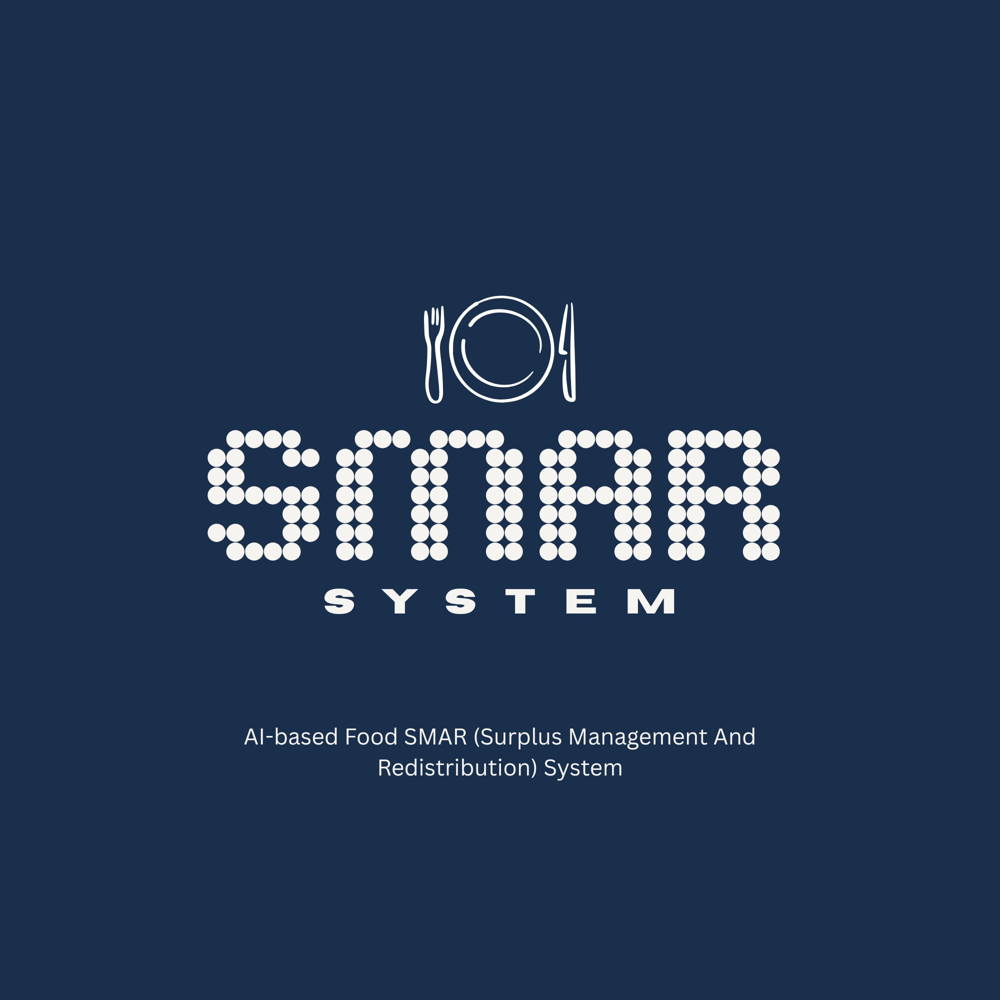
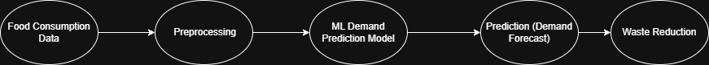
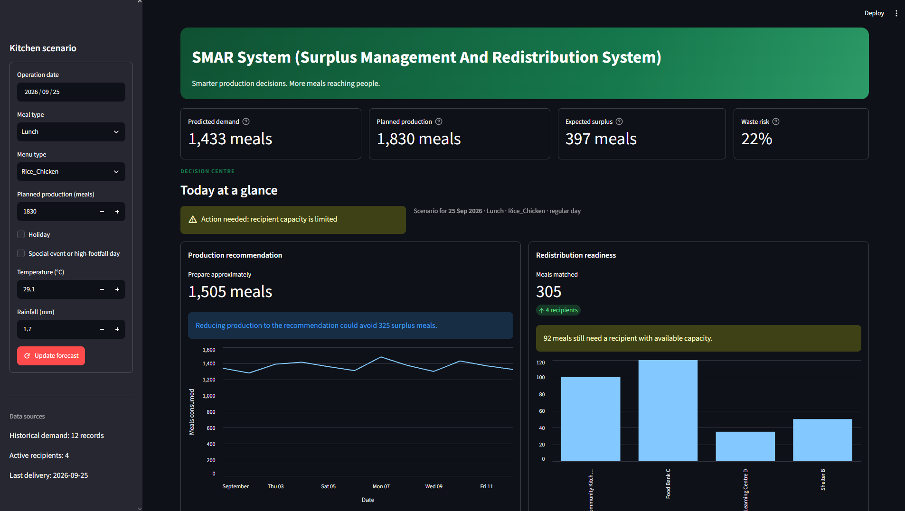

<p align="center">
	
</p>

# SMAR System (Surplus Management And Redistribution System)

Primary Dev: Mohamad Musadiq (ARQORYN)

SMAR System (Surplus Management And Redistribution System) is a Streamlit
prototype for reducing food waste in institutional
kitchens. It combines demand forecasting with surplus planning, recipient
matching, and redistribution tracking. The project supports **UN SDG 12:
Responsible Consumption and Production** and **SDG 13: Climate Action**.

## What It Does

For a selected kitchen scenario, the dashboard:

1. Predicts meal demand from historical kitchen operations.
2. Compares predicted demand with planned production.
3. Estimates surplus and waste risk.
4. Recommends production at forecasted demand plus a 5% buffer.
5. Matches surplus to active recipients based on priority, need, capacity, and distance.
6. Builds a simple route order and records the redistribution plan.
7. Summarizes delivered meals, recipients served, and estimated avoided CO2e.

The application is designed for one kitchen and uses local CSV files. It is a
working prototype rather than a production logistics or emissions accounting system.

## Map and Routing

The dashboard includes a recipient-matching and route-planning view that visualizes surplus redistribution on a map. It plots the kitchen location together with eligible recipients, then orders the route by urgency, current need, and shorter travel distance. The map highlights how many meals each recipient receives and summarizes the total route distance for the planned redistribution.

This route planning layer is intended as a lightweight operational aid for a single kitchen scenario; it does not optimize full road-network mileage or vehicle routing.

## Screenshots and Diagrams

### System Architecture


### Dashboard Mockup


## Technology

- Python 3.10+
- Streamlit for the interactive dashboard
- Pandas and NumPy for data handling
- scikit-learn Ridge regression with one-hot encoded categorical features
- Joblib for the cached model artifact

## Setup

From the project root, create or activate a virtual environment and install the
dependencies:

```powershell
python -m venv .venv
.\.venv\Scripts\Activate.ps1
python -m pip install -r requirements.txt
```

Start the dashboard with:

```powershell
python -m streamlit run dashboard.py
```

Streamlit will open the application in a browser. In the sidebar, choose the
operation date, menu, production quantity, weather, and event indicators, then
select **Update forecast** to recalculate the scenario.

## Model Behavior

The model is trained from `data/kitchen_history.csv`. It uses:

- Day of week
- Meal type and menu type
- Holiday and special-event flags
- Temperature and rainfall

The target is `actual_consumption`. On first startup, the trained pipeline is
saved as `demand_model.joblib`; subsequent launches load that file. If the
artifact is missing or cannot be loaded, it is trained again from the history data.

Expected surplus is calculated as:

```text
max(planned production - predicted demand, 0)
```

Recipient matching considers only rows where `active` is `1`. Higher-priority
recipients are considered first, followed by current need and shorter distance.
Allocations are limited by both each recipient's need and capacity.

## Data Files

All operational data is stored in [`data/`](./data):

| File | Purpose | Required columns |
| --- | --- | --- |
| [`kitchen_history.csv`](./data/kitchen_history.csv) | Training history and dashboard trend data | `date`, `meal_type`, `menu_type`, `actual_consumption`, weather and event fields |
| [`daily_operations.csv`](./data/daily_operations.csv) | Default scenario loaded by the dashboard | `date`, `meal_type`, `menu_type`, `planned_quantity`, `holiday`, `special_event` |
| [`recipients.csv`](./data/recipients.csv) | Organizations eligible for matching | `recipient_id`, `name`, `capacity`, `current_need`, `priority`, `distance_km`, `active` |
| [`redistribution_records.csv`](./data/redistribution_records.csv) | Planned and delivered allocations | `date`, `recipient_id`, `allocated_quantity`, `distance_km`, `status` |

Use `status=Delivered` for completed deliveries. The Impact and analytics tab
counts delivered records only; newly recorded dashboard plans have status
`Planned` until the CSV is updated.

## Project Structure

```text
dashboard.py                 Streamlit application
src/data_preprocessing.py    CSV loading, validation, and record persistence
src/demand_prediction.py     Feature preparation and model training/inference
src/maps.py                  Route visualization helpers for recipient and kitchen locations
data/                        Local operational datasets
diagrams/                    Architecture and dashboard visuals
demand_model.joblib          Generated model artifact
```

## Limitations

- The prototype uses a local CSV store and has no authentication or multi-kitchen support.
- Route ordering is priority-based; it is not a road-network optimization.
- The avoided-emissions figure uses a simple estimate of `0.5 kg CO2e` per redistributed meal.
- Editing or replacing training data requires rerunning the app; remove `demand_model.joblib` to force model retraining.
