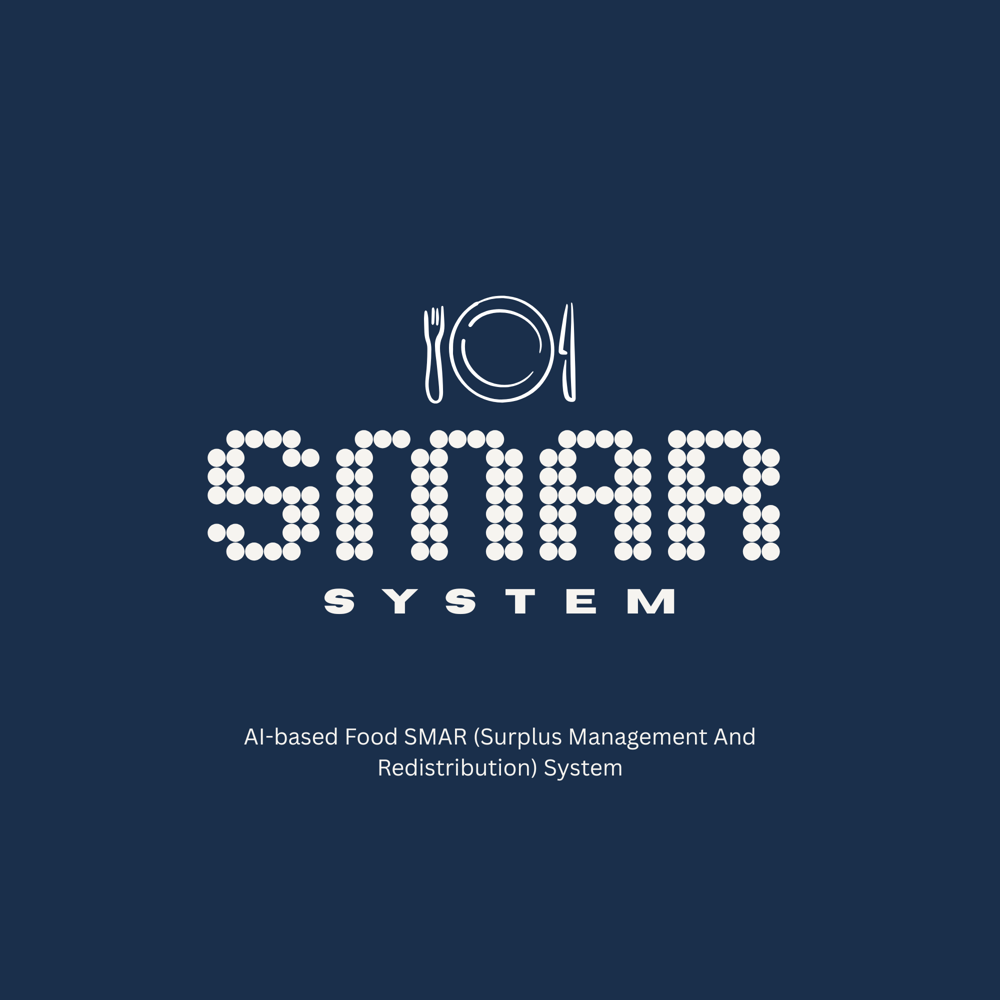
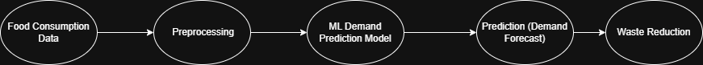
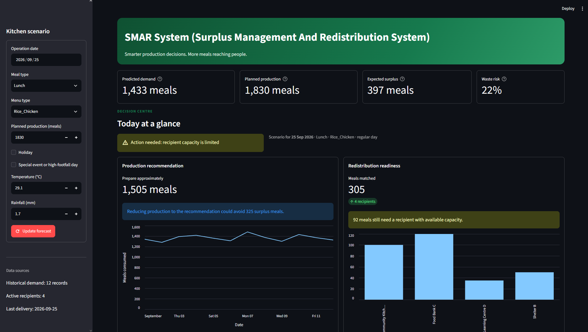

<p align="center">
	
</p>

# SMAR System (Surplus Management And Redistribution System)

Primary Dev: Mohamad Musadiq (ARQORYN)

SMAR System (Surplus Management And Redistribution System) is a Streamlit
prototype for reducing food waste in institutional
kitchens. It combines demand forecasting with surplus planning, recipient
matching, and redistribution tracking. The project supports **UN SDG 12:
Responsible Consumption and Production** and **SDG 13: Climate Action**.

## What It Does

For a selected kitchen scenario, the dashboard:

1. Predicts daily meal demand from historical kitchen operations.
2. Allocates predicted demand to individual menu items using consumption shares.
3. Compares predicted demand with planned production and recommends adjustments.
4. Estimates surplus and waste risk per item.
5. Matches surplus to active recipients based on priority, need, capacity, and distance.
6. Builds a route order and records the redistribution plan on a map.
7. Tracks operational surplus inventory with expiry status.
8. Records end-of-day actuals per item and creates inventory batches automatically.
9. Summarizes delivered meals, recipients served, and estimated avoided CO₂e.

The application is designed for one kitchen and uses local CSV files. It is a
working prototype rather than a production logistics or emissions accounting system.

## Map and Routing

The dashboard includes a recipient-matching and route-planning view that visualizes surplus redistribution on a map. It plots the kitchen location together with eligible recipients, then orders the route by urgency, current need, and shorter travel distance. The map highlights how many meals each recipient receives and summarizes the total route distance for the planned redistribution.

This route planning layer is intended as a lightweight operational aid for a single kitchen scenario; it does not optimize full road-network mileage or vehicle routing.

## Screenshots and Diagrams

### System Architecture


### Dashboard Mockup


## Technology

- Python 3.10+
- Streamlit for the interactive dashboard
- Pandas and NumPy for data handling
- scikit-learn Ridge regression with one-hot encoded categorical features
- Joblib for cached model artifacts
- Altair and Matplotlib for charts
- PyDeck for interactive route maps

## Setup

From the project root, create or activate a virtual environment and install the
dependencies:

```powershell
python -m venv .venv
.\.venv\Scripts\Activate.ps1
python -m pip install -r requirements.txt
```

Start the dashboard with:

```powershell
python -m streamlit run dashboard.py
```

Streamlit will open the application in a browser. Use the **Kitchen Scenario** button
in the sidebar to configure the operation date, planned production, weather,
precipitation, holiday/event flags, safety buffer, and selected menu items for the day.

## Model Behavior

The daily demand model is trained from `data/daily_history.csv`. It uses:

- Day of week
- Holiday and special-event flags
- Weather category
- Precipitation category

The target is `actual_consumption`. On first startup the trained pipeline is
saved as `daily_demand_model.joblib`; subsequent launches load that file. If the
artifact is missing, uses an older schema version, or cannot be loaded, it is
retrained from the history data.

A separate item-level model (`src/demand_prediction.py`) provides
meal/menu-type granularity when available.

### Item-Level Allocation

Daily predicted demand is allocated to individual menu items using deterministic
historical consumption shares (`calculate_item_shares` +
`allocate_daily_to_items` in `src/daily_demand_model.py`). The largest-remainder
method guarantees integer quantities that sum exactly to the daily total.

### Planned Production & Surplus

Planned production is operational context used after prediction; it is not a
demand-model feature. Expected surplus:

```text
max(planned production - predicted demand, 0)
```

Recommended production = predicted demand × (1 + safety_buffer / 100).

### Surplus Inventory

Positive item-level surplus recorded at End of Day is automatically added to an
operational inventory (`data/inventory.csv`) with a per-item expiry date derived
from `data/surplus_shelf_life.csv`. Inventory batches progress through statuses
Available → Expiring Soon → Expired → Depleted.

### Recipient Matching & Redistribution

Recipient matching considers only rows where `active` is `1`. Higher-priority
recipients are considered first, followed by current need and shorter distance.
Allocations are limited by both each recipient's need and capacity. When
redistributing from inventory, the matched item's batch is decremented
automatically.

## Data Files

All operational data is stored in [`data/`](./data):

| File | Purpose | Required columns |
| --- | --- | --- |
| [`daily_history.csv`](./data/daily_history.csv) | Daily-level training history for the demand model | `date`, `predicted_demand`, `actual_production`, `actual_consumption`, `surplus_quantity`, `holiday`, `special_event`, `weather`, `precipitation` |
| [`daily_operations.csv`](./data/daily_operations.csv) | Default current scenario and planning context | `date`, `planned_quantity`, `holiday`, `special_event`, `weather`, `precipitation`, `safety_buffer` |
| [`item_history.csv`](./data/item_history.csv) | Per-item consumption history used for allocation shares | `date`, `menu_item`, `predicted_quantity`, `actual_production`, `actual_consumption`, `surplus_quantity` |
| [`inventory.csv`](./data/inventory.csv) | Operational surplus batches awaiting redistribution | `inventory_id`, `date_added`, `menu_item`, `original_quantity`, `remaining_quantity`, `expiry_date`, `status` |
| [`surplus_shelf_life.csv`](./data/surplus_shelf_life.csv) | Demo shelf-life configuration per menu item | `menu_item`, `shelf_life_days` |
| [`kitchen_history.csv`](./data/kitchen_history.csv) | Meal/menu-level development history | `date`, `meal_type`, `menu_type`, `predicted_demand`, `actual_production`, `actual_consumption`, `surplus_quantity`, `holiday`, `special_event`, `weather`, `precipitation` |
| [`recipients.csv`](./data/recipients.csv) | Organizations eligible for matching | `recipient_id`, `name`, `type`, `latitude`, `longitude`, `capacity`, `current_need`, `priority`, `distance_km`, `active` |
| [`redistribution_records.csv`](./data/redistribution_records.csv) | Planned and delivered allocations | `date`, `recipient_id`, `allocated_quantity`, `distance_km`, `status`, `menu_item` |

The development history is synthetic sample data for validating the schema and
pipeline. It is not a claim about real institutional kitchen behavior.

Weather and precipitation combinations are validated centrally. Supported
combinations are: Sunny/No precipitation; Cloudy/No Rain, Light Rain, or Heavy
Rain; Rainy/Light Rain or Heavy Rain; and Snowy/Light Snow or Heavy Snow.

Use `status=Delivered` for completed deliveries. The Impact and analytics tab
counts delivered records only; newly recorded dashboard plans have status
`Planned` until the CSV is updated.

## Project Structure

```text
dashboard.py                   Streamlit application
src/daily_demand_model.py      Daily demand model, item shares, and allocation
src/demand_prediction.py       Meal/menu-level model (legacy / supplementary)
src/data_preprocessing.py      CSV loading, validation, and record persistence
src/inventory.py               Surplus inventory: expiry, status, and decrements
src/maps.py                    PyDeck route visualization helpers
data/                          Local operational datasets (CSV)
diagrams/                      Architecture and dashboard visuals
daily_demand_model.joblib      Generated daily model artifact
demand_model.joblib            Generated meal-level model artifact
```

## Workflow Sections

The sidebar navigation exposes the following workspace sections:

1. **Overview / Today** – KPIs, recommendation, demand trend, surplus journey snapshot.
2. **Demand & Planning** – Model details, production breakdown, scenario controls.
3. **Recipient Matching** – Item-level plan generation, inventory decrement, route map.
4. **Surplus Inventory** – Batch view with expiry status, redistribute actions.
5. **Impact & Analytics** – Period-filtered impact metrics, item-level surplus, CO₂e.
6. **End of the Day** – Record actual consumption per item; auto-create inventory.
7. **Settings** – Read-only system information.

## Limitations

- The prototype uses a local CSV store and has no authentication or multi-kitchen support.
- The current kitchen history is synthetic development data and should be replaced with verified operational observations before production use.
- Item allocation shares use historical averages and do not account for day-of-week item preferences.
- Route ordering is priority-based; it is not a road-network optimization.
- The avoided-emissions figure uses a simple estimate of `0.5 kg CO₂e` per redistributed meal; actual impact varies by food type and lifecycle.
- Shelf-life values in `surplus_shelf_life.csv` are prototype defaults and not food-safety guidance.
- Adding actual historical outcomes requires appending a complete, non-duplicate observation; the model retrains automatically when the data fingerprint changes.
